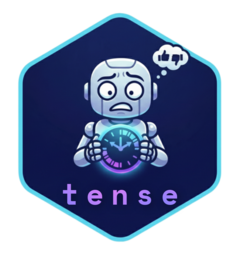
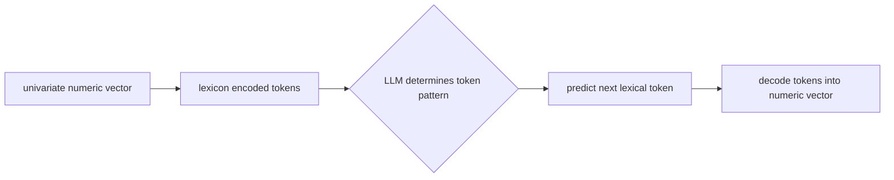
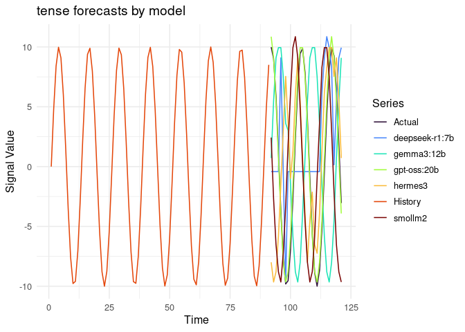

<!-- README.md is generated from README.Rmd. Please edit that file -->

# tense 

`tense` is an R package that uses a large language model to forecast any
univariate ordered numeric sequence (time series, spatial profiles,
simulation traces, etc.). It works by mapping numeric values to a fixed
sentiment lexicon (e.g., “excellent”, “solid”, “poor”, “dire”), feeding
the resulting word sequence to an LLM with a sliding context window, and
asking the model to continue the pattern. The output is a numeric
forecast by decoding sequences of sentiment words that describes the
predicted trajectory. The package provides `tense_init()`,
`tense_fit()`, `tense_predict()`.

note that LLMs are stochastic in nature. predicting univariate ordered
sequences using large language models via sentiment-encoded prompts will
return different results every time. The results will also be different
depending on the LLM used, temperature setpoint, & context window
length.

### tense flow diagram



## a tense example

comparison of different models, temperatures, and context windows.
**Note that results will change every time the code is executed, even
with seeds set LLM results can vary.**

``` r
library(tense)
library(ggplot2)

t <- seq(0, 60, by = 0.5)
y <- sin(t) * 10
train <- y[1:(length(y) - 30)]
test <- y[(length(y) - 29):length(y)]

h <- length(test)
```

``` r

model_names <- c(
  "gpt-oss:20b",
  "hermes3",
  "gemma3:12b",
  "smollm2",
  "deepseek-r1:7b"
)
context_windows <- c(30, 45, 25, 60, 90)
temperatures <- c(0.10, 0.45, 1.00, 0.20, 0.31)

df_plot <- rbind(
  data.frame(
    Time = 1:length(train),
    Value = train,
    Model = "History"
  ),
  data.frame(
    Time = (length(train) + 1):(length(train) + h),
    Value = test,
    Model = "Actual"
  )
)

# loop: init, fit, predict, bind
for (i in seq_along(model_names)) {
  spec <- tense_init(
    model_name = model_names[i],
    context_window = context_windows[i],
    temperature = temperatures[i]
  )

  model_i <- tense_fit(spec, train)
  fc_i <- tense_predict(model_i, h = h)

  df_fc_i <- data.frame(
    Time = (length(train) + 1):(length(train) + h),
    Value = fc_i,
    Model = model_names[i]
  )

  df_plot <- rbind(df_plot, df_fc_i)
}
#> LLM Learning & Inferring ...
#> Predicted Lexicon: wonderful, excellent, positive, steady, weak, bad
#> LLM Learning & Inferring ...
#> Waiting 2s for retry backoff ■■■■■■■■■■■■■■■                                                                               Waiting 3s for retry backoff ■■■■■■■■■■■■                    Waiting 3s for retry backoff ■■■■■■■■■■■■■■                  Waiting 3s for retry backoff ■■■■■■■■■■■■■■■■■■■■■■■■■       Waiting 3s for retry backoff ■■■■■■■■■■■■■■■■■■■■■■■■■■■     Waiting 3s for retry backoff ■■■■■■■■■■■■■■■■■■■■■■■■■■■■■                                                                 Predicted Lexicon: bad, depressing, unfortunate, lacking, mediocre, decent
#> LLM Learning & Inferring ... 
#> Predicted Lexicon: steady, positive, excellent, superb, superb, solid
#> LLM Learning & Inferring ... 
#> Predicted Lexicon: acceptable, shaky, poor, unfortunate, depressing, negative
#> LLM Learning & Inferring ... 
#> Predicted Lexicon: <think>
#> Alright, so Ive got this query where someone is asking me to predict the next 30 emotional states based on a given stream of emotions Lets break it down
#> 
#> First, they provided a log of emotional intensity over time, with feelings going up and down The current stream has a lot of positive words like promising, excellent, wonderful that are repeated multiple times Then theres a dip into negatives like negative
#> Warning in decode_sentiment(pred_words, model$lexicon): LLM used words outside
#> the lexicon. Imputing with 'neutral'.

# plot: solid lines + points, color = model only
ggplot(df_plot, aes(x = Time, y = Value, color = Model)) +
  geom_line() +
  theme_minimal(base_size = 12) +
  scale_color_viridis_d(option = "turbo") +
  labs(
    title = "tense forecasts by model",
    y = "Signal Value",
    color = "Series"
  )
```



*tense was originally written by Gemini then debugged with Sonar.
Packaged via Gemini, Claude Opus, & then documented with Sonar.*
